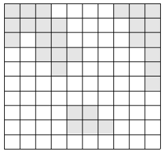
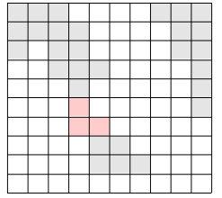
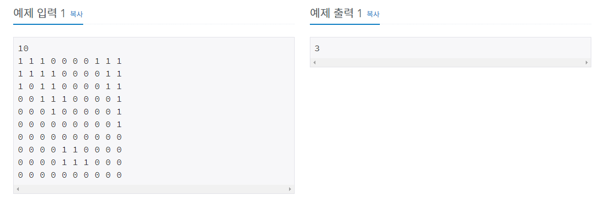

# 다리 만들기 [2146]

백준 - https://www.acmicpc.net/problem/2146

깃헙 - https://github.com/shs9509/study


### 문제

- 여러 섬으로 이루어진 나라가 있다. 이 나라의 대통령은 섬을 잇는 다리를 만들겠다는 공약으로 인기몰이를 해 당선될 수 있었다. 

- 하지만 막상 대통령에 취임하자, 다리를 놓는다는 것이 아깝다는 생각을 하게 되었다. 

- 그는, 생색내는 식으로 한 섬과 다른 섬을 잇는 다리 하나만을 만들기로 하였고, 그 또한 다리를 가장 짧게 하여 돈을 아끼려 하였다.

- 이 나라는 N×N크기의 이차원 평면상에 존재한다. 

- 이 나라는 여러 섬으로 이루어져 있으며, 섬이란 동서남북으로 육지가 붙어있는 덩어리를 말한다. 

- 다음은 세 개의 섬으로 이루어진 나라의 지도이다.

  

  


- 위의 그림에서 색이 있는 부분이 육지이고, 색이 없는 부분이 바다이다. 
- 이 바다에 가장 짧은 다리를 놓아 두 대륙을 연결하고자 한다. 
- 가장 짧은 다리란, 다리가 격자에서 차지하는 칸의 수가 가장 작은 다리를 말한다. 
- 다음 그림에서 두 대륙을 연결하는 다리를 볼 수 있다.





- 물론 위의 방법 외에도 다리를 놓는 방법이 여러 가지 있으나, 위의 경우가 놓는 다리의 길이가 3으로 가장 짧다(물론 길이가 3인 다른 다리를 놓을 수 있는 방법도 몇 가지 있다).


- 지도가 주어질 때, 가장 짧은 다리 하나를 놓아 두 대륙을 연결하는 방법을 찾으시오.

------


### 입력

- 첫 줄에는 지도의 크기 N(100이하의 자연수)가 주어진다. 
- 그 다음 N줄에는 N개의 숫자가 빈칸을 사이에 두고 주어지며, 0은 바다, 1은 육지를 나타낸다. 
- 항상 두 개 이상의 섬이 있는 데이터만 입력으로 주어진다.


### 출력

- 첫째 줄에 가장 짧은 다리의 길이를 출력한다.




-----


## 풀이과정

-  3개의 섬의 거리를 ''모두'' 알아야한다.
- 고민 해봐야할 것은 '각 섬의 위치' 인데 이것을 dfs 로 섬마다 인덱스값으로 설정해준다. (1번섬, 2번섬, 3번섬)
- 해당 섬의 좌표를 스택에 넣고 다른섬을 만날때까지 bfs 를 해주자. 


```python
import sys
from collections import deque

dr = [0,0,1,-1]
dc = [1,-1,0,0]

scale = int(input())
land = list()
for i in range(scale):
    land.append(list(map(int,input().split())))

check = [[False] * scale for _ in range(scale)] # 섬 확인시 체크용리스트
ans = sys.maxsize # 이러면 최대값이 늘어난다.
count = 1

### dfs ###
def dfs(x,y): # dfs를 통해서 섬들을 체크해준다. 1번섬, 2번섬, 3번섬
    global count
    S =list()
    S.append((x,y))
    while S:
        x,y =S.pop()
        check[x][y] = True
        land[x][y] = count
        for i in range(4):
            nx, ny = x + dr[i], y + dc[i]
            if nx < 0 or nx >= scale or ny < 0 or ny >= scale:
                continue
            if check[nx][ny] == False and land[nx][ny]:
                S.append((nx, ny))

### 섬체크 ###
for x in range(scale):
    for y in range(scale):
        if check[x][y] == False and land[x][y] == 1:
            dfs(x, y)
            count += 1


### bfs ###
def bfs(z):
    global ans
    dist = [[-1] * scale for _ in range(scale)] # 거리를 나타내는 배열
    q = deque()

    for x in range(scale):
        for y in range(scale):
            if land[x][y] == z:
                q.append((x, y)) # q에 해당섬의 좌표를 다넣는다.
                dist[x][y] = 0
    while q:
        x, y = q.popleft()
        for i in range(4):
            nx, ny = x + dc[i], y + dr[i]
            if nx < 0 or nx >= scale or ny < 0 or ny >= scale: # 범위를 넘어가면
                continue
            if land[nx][ny] > 0 and land[nx][ny] != z:  # 다른섬에 도착했을때
                ans = min(ans, dist[x][y])
                return
            if land[nx][ny] == 0 and dist[nx][ny] == -1: # 방문 안한곳
                dist[nx][ny] = dist[x][y] + 1
                q.append((nx, ny))


for i in range(1, count): # 1번섬부터 쭉 돌려본다.
    bfs(i)

print(ans)
```


------


### 느낀점


- 풀지 못해서 해답을 본 문제였고 막힌 부분은 섬을 1,2,3,번 섬으로 값을 넣어서 할 생각을 못했다.
  - 생각해보면 이미 해봤던 과정이고 dfs, bfs 가 혼합된 문제여서 접근하지 못했다.
- 참고한 풀이
  - https://velog.io/@injoon2019/%EC%95%8C%EA%B3%A0%EB%A6%AC%EC%A6%98-%EB%B0%B1%EC%A4%80-2146-%EB%8B%A4%EB%A6%AC%EB%A7%8C%EB%93%A4%EA%B8%B0-%ED%8C%8C%EC%9D%B4%EC%8D%AC
  - 기존의 풀이는 재귀를 이용해서 풀었는데 재귀깊이를 넘어가는것에 좀 거부감을 느껴서 바꿔줬다.
  - 하지만 코드상 간단한 방식이였고 import를 쓸수있다면 사용하는게 맞지않을까 생각한다. (생각 안나면?)

```python
sys.setrecursionlimit(10 ** 6)

### dfs ###
 def dfs(x,y): # dfs를 통해서 섬들을 체크해준다. 1번섬, 2번섬, 3번섬
     global count
     check[x][y] = True
     land[x][y] = count
   
     for i in range(4):
         nx, ny = x + dr[i], y + dc[i]
         if nx < 0 or nx >= scale or ny < 0 or ny >= scale:
             continue
         if check[nx][ny] == False and land[nx][ny]:
             dfs(nx,ny)
```


밑에가 재귀를 쓴 결과값으로 시간은 더줄지만 메모리를 더많을 쓰는 것을 볼수있다.


- bfs 와 dfs 이렇게 두가지 방법이 혼합된 문제가 익숙치 않아서 어려운거 같다.

