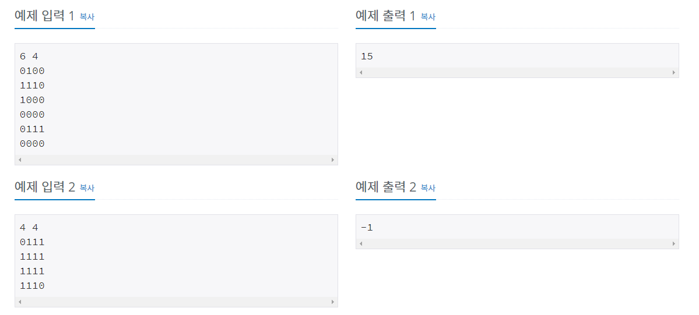

# 벽 부수고 이동하기 [2206]

백준 - https://www.acmicpc.net/problem/2206

깃헙 - https://github.com/shs9509/study


### 문제

- N×M의 행렬로 표현되는 맵이 있다.
- 맵에서 0은 이동할 수 있는 곳을 나타내고, 1은 이동할 수 없는 벽이 있는 곳을 나타낸다. 
- 당신은 (1, 1)에서 (N, M)의 위치까지 이동하려 하는데, 이때 최단 경로로 이동하려 한다.
- 최단경로는 맵에서 가장 적은 개수의 칸을 지나는 경로를 말하는데, 이때 시작하는 칸과 끝나는 칸도 포함해서 센다.
- 만약에 이동하는 도중에 한 개의 벽을 부수고 이동하는 것이 좀 더 경로가 짧아진다면, 벽을 한 개 까지 부수고 이동하여도 된다.
- 한 칸에서 이동할 수 있는 칸은 상하좌우로 인접한 칸이다.
- 맵이 주어졌을 때, 최단 경로를 구해 내는 프로그램을 작성하시오.

------


### 입력

- 첫째 줄에 N(1 ≤ N ≤ 1,000), M(1 ≤ M ≤ 1,000)이 주어진다. 
- 다음 N개의 줄에 M개의 숫자로 맵이 주어진다. 
- (1, 1)과 (N, M)은 항상 0이라고 가정하자.

### 출력

- 첫째 줄에 최단 거리를 출력한다. 

- 불가능할 때는 -1을 출력한다.

  



-----


## 틀린 풀이과정

- 못풀엇다!
- 밑에 맞는 풀이과정이 있다.
- bfs로 접근하고 벽을 뿌셧다는 표현인 falg를 통해서 나타내려고 했으나
- bfs가 돌면서 벽뚫고 갔는지, 안뚫고 가는지에 대해서 겹처서 사라지는 경우가 생긴다.
- 그래서 if 문 어떻게 어떻게 써서 해결하려고 했으나 실패! 


```python
dr=[-1,1,0,0]
dc=[0,0,1,-1]

row, col = list(map(int, input().split()))
road = list()
for r in range(row):
    road.append(list(map(int,input())))

# print(row, col, road)

def bfs():
    S= list()
    S.append((0,0,True))
    visit= [[0 for a in range(col)] for _ in range(row)]
    # print(visit)
    visit[0][0]= 1
    while S:
        x,y,flag = S.pop(0)
        for i in range(4):
            print(S)
            X = x+dr[i]
            Y = y+dc[i]
            if 0 <= X < row and 0 <= Y <col:
                if visit[X][Y] == 0:	#방문 안했을떄
                    if road[X][Y] == 0 :	#길이 있을떄
                        S.append((X,Y,flag))	#스택에 추가
                        visit[X][Y] = visit[x][y] + 1

                    elif road[X][Y] == 1 and flag:	#길이없고 뚫을수있으면
                        S.append((X,Y,False))	#스택에 추가
                        visit[X][Y] = visit[x][y] + 1	#visit에 거리 추가
                elif visit[X][Y] == visit[x][y]+1 and (X,Y,False) in S and flag:
                    S.append((X,Y,True)) # 만약 이미 지나간곳을 또 지나갈수있어야함! 
    print(visit)
    
    if visit[row-1][col-1]==0:
        return -1
    else:
        return visit[row-1][col-1]

print(bfs())


'''
6 4
0000
1110
0000
0000
0111
0000

[1, 2, 3, 4], 
[2, 3, 4, 5], 
[3, 4, 5, 6],
[4, 5, 6, 7],
[5, 0, 0, 8],
[6, 7, 8, 9],

결과가 이런식으로 나온다 중간에 0을 지나가지 않는다!

'''
```


-------


## 맞는 풀이과정


- bfs 와 flag를 쓰는것은 맞는 접근법이라 생각하엿고

- 답을 찾아본 결과, flag 를 쓰기보다 3차원배열로서 접근하였다.

- 즉슨, 2차원배열에서 벽을 뿌시면 다음 차원으로가서 길을 찾는다는것!

  

  - 벽 안뿌심 - 원래있던 미로에서 진행 , 뿌술기회 1번남았다고 생각하고 bfs 진행
  - 벽 뿌심 - 다른 미로로 시작(현재자리) 단 뿌술기회가 없다고생각하고 bfs 진행


- 3차원 배열이라고 생각하기보다 미로 두개를 가지고 bfs 를 돌렸다고 생각하면 편하다.
- 추가적으로 응용이 된다면 벽을 여러번 뿌실수있다고 생각하면 그만큼, 미로 개수를 늘리면 되는것! 


```python
import sys
from collections import deque
input = sys.stdin.readline
dx = [1, -1, 0, 0]
dy = [0, 0, -1, 1]

def bfs():
    q = deque()
    q.append([0, 0, 1]) #x좌표, y좌표, 벽뚫가능여부
    visit = [[[0] * 2 for i in range(m)] for i in range(n)]
    
    #visit의 [0] * 2  하는 이유는 ['a', 0] 'a' 에 방문표시를 쓰다가 벽을뿌시면 [0,'b'] 'b'에 방문표시하기 위함! ( 위에 설명했던 다른 미로로 시작하는 것!) 
    
    visit[0][0][1] = 1
    while q:
        a, b, w = q.popleft()
        if a == n - 1 and b == m - 1:
            return visit[a][b][w] #끝에 도착하면 거리를 리턴한다.
        for i in range(4):
            x = a + dx[i]
            y = b + dy[i]
            if 0 <= x < n and 0 <= y < m:
                if s[x][y] == 1 and w == 1: # 벽만나고 벽뚫가능!
                    visit[x][y][0] = visit[a][b][1] + 1	#벽뚫햇으니, 미로를 바꾸고 이어서 진행
                    q.append([x, y, 0])
                elif s[x][y] == 0 and visit[x][y][w] == 0: # 벽아니고,방문도 안했었음!
                    visit[x][y][w] = visit[a][b][w] + 1	#거리추가하면서, 방문표시
                    q.append([x, y, w])
        # print(visit)
    return -1 #끝에 도착 못하면 -1

n, m = map(int, input().split())
s = []
for i in range(n):
    s.append(list(map(int, list(input().strip()))))
print(bfs())
```

-  사용된 코드 : https://pacific-ocean.tistory.com/348


------


### 느낀점


- 상당히 어려운 문제였고, 처음에는 답을 봐도 이해하질 못했다.
- 나중에 설명을 듣고 이해를 하였는데 상당히 퀄리티있는 문제가 아닐까 생각된다.
- bfs 문제를 왠만해서는 풀수있겠다 생각했었지만 다시 나를 겸손하게 만든 문제였다.

