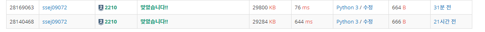

# 숫자판 점프 [2210]

백준 - https://www.acmicpc.net/problem/2210

깃헙 - https://github.com/shs9509/study


### 문제

- 5×5 크기의 숫자판이 있다. 
- 각각의 칸에는 숫자(digit, 0부터 9까지)가 적혀 있다. 
- 이 숫자판의 임의의 위치에서 시작해서, 인접해 있는 네 방향으로 다섯 번 이동하면서, 각 칸에 적혀있는 숫자를 차례로 붙이면 6자리의 수가 된다. 
- 이동을 할 때에는 한 번 거쳤던 칸을 다시 거쳐도 되며, 0으로 시작하는 000123과 같은 수로 만들 수 있다.
- 숫자판이 주어졌을 때, 만들 수 있는 서로 다른 여섯 자리의 수들의 개수를 구하는 프로그램을 작성하시오.

------


### 입력

- 다섯 개의 줄에 다섯 개의 정수로 숫자판이 주어진다.


### 출력

- 첫째 줄에 만들 수 있는 수들의 개수를 출력한다.


-----


## 풀이과정

-  숫자판의 각좌표를 시작지점으로 잡는다.
-  시작지점으로부터 dfs를 돌려서 경로를 계속 누적시킨다.
-  누적시킨 경로의 자리값이 6이 되면 그대로 리스트에 넣어줘서 나중에 리스트의 길이를 통해 답을 출력한다.


```python
def dfs(x,y,number):# 시작지점과 경로(number)를 인자로 받는다.
    if len(number)==6: # 만약 number가 6자리면
        tmp.append(number)  # tmp에 넣어준다.
        return

    for i in range(4): # 사방탐색해서 경로를만든다.
        nx = x + dr[i]
        ny = y + dc[i]
        if 0<=nx<5 and 0<=ny<5: # 숫자판을 넘지않는다면 dfs를 돌려서 다음경로를 찾는다.
            dfs(nx,ny,number+li[nx][ny]) # li[nx][ny]를 다음경로로 추가해준다.
                                         # 이과정을 계속하면 number에 경로가 쌓인다. 

li= list() # 숫자판
dr = [0,0,-1,1] # 사방탐색을 위한 재료
dc = [1,-1,0,0]
tmp = list()    # 6번의 경로들이 저장되는 곳
for i in range(5):
    li.append(input().split())


for x in range(5):
    for y in range(5): # 시작지점 x,y를 지정해서 dfs 를 돌린다.
        dfs(x,y,li[x][y])


print(len(set(tmp))) # 중복된경로를 없애기 위해서 set을 써준다.
```


------


### 느낀점


- 비효율적인 생각밖에 나지않았다. ( 그런데 답이 비효율적인 방법이네?)

- 그런데 다시 생각해보면 dfs를 5번 돌리는거니 그렇게 비효율적인 것도 아닌것같다.

- 이문제는 ''경로를 이어서 추가''하는 방법을 생각 못해서 풀지 못했다.

  - string 을 더해서 값을 추가하는 이런 센스가 부족하다.

- 답은 https://claude-u.tistory.com/433 여기를 참고했다.

  - 기존의 답을 set 을 안쓰고 not in 을 통해 중복을 걸렀는데
  - not in 자체가 시간을 엄청 먹어서 set으로 바꾸었다.

  




- 보면 8배정도 차이가 난다.
- 단순한 문제지만 아직 파이썬 자체에대해 센스가 부족을 느낀 문제였다.