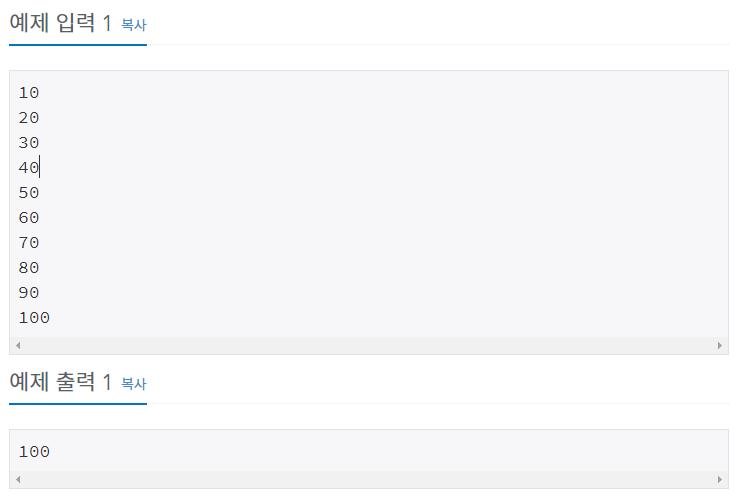

# 슈퍼 마리오 [2851]

백준 - https://www.acmicpc.net/problem/2851


### 문제

- 슈퍼 마리오 앞에 10개의 버섯이 일렬로 놓여져 있다. 이 버섯을 먹으면 점수를 받는다.
- 슈퍼 마리오는 버섯을 처음부터 나온 순서대로 집으려고 한다.
- 모든 버섯을 집을 필요는 없고 중간에 중단할 수 있다. 
- 중간에 버섯을 먹는 것을 중단했다면, 그 이후에 나온 버섯은 모두 먹을 수 없다. 
- 따라서 첫 버섯을 먹지 않았다면, 그 이후 버섯도 모두 먹을 수 없다.
- 마리오는 받은 점수의 합을 최대한 "100"에 가깝게 만들려고 한다.
- 버섯의 점수가 주어졌을 때, 마리오가 받는 점수를 출력하는 프로그램을 작성하시오.
- 

### 입력

- 총 10개의 줄에 각각의 버섯의 점수가 주어진다.
- 이 값은 100보다 작거나 같은 양의 정수이다. 
- 버섯이 나온 순서대로 점수가 주어진다.


### 출력

- 첫째 줄에 마리오가 받는 점수를 출력한다. 
- 만약 100에 가까운 수가 2개라면 (예: 98, 102) 마리오는 큰 값을 선택한다.



## 풀이과정


- 슈퍼마리오가 먹는 버섯값을 더하면서 100에 최대한 가깝게 도달한다.
- 차이를 가장 적게 하기위해 abs 를 이용했다.
- 값을 더하고 비교하기 때문에 비교했을 시 100보다 더멀어지면 다시 그값을 뺀다.

```python
mush= list()    # 슈퍼마리오가 먹을 버섯
for i in range(10):
    mush.append(int(input()))
sum=0
for j in range(10):
    sum += mush[j] # 일단 버섯값을 더한다.
    if abs(100-sum)<=abs(100-(sum-mush[j])): # 절댓값(abs) 이용해서 100이랑 더가까운것을 고른다.
        continue
    else:
        sum -= mush[j]  # 100에서 더 멀어지면 더햇던 버섯값을 뺀다.
        break

print(sum)
```


### 느낀점

- 괜히 슈퍼마리오라니깐 맨 아래꺼부터 먹는 줄 알았다. 
- 어차피 위치를 조정하면 양수로 나타날텐데 굳이 abs 쓸 이유가? 없다.  miss..