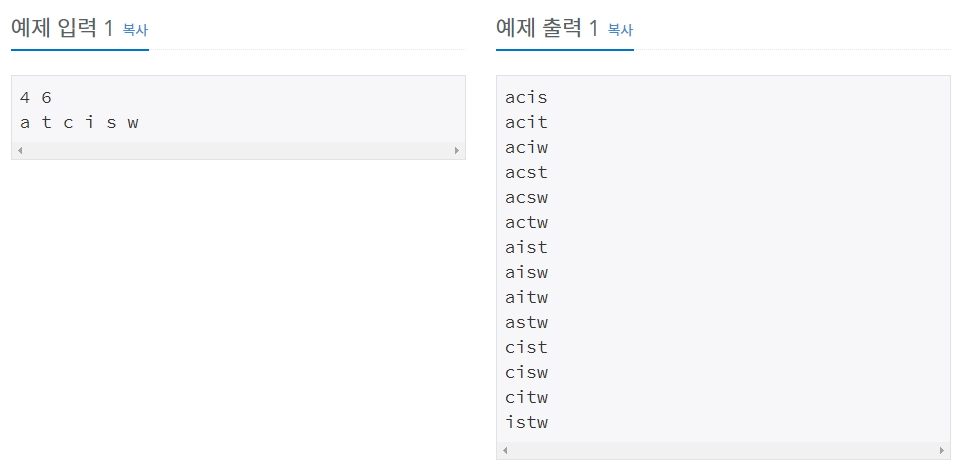
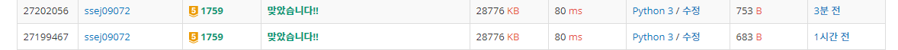

# 암호만들기 [1759]

백준 - https://www.acmicpc.net/problem/1759

깃헙 - https://github.com/shs9509/study


### 문제

- 바로 어제 최백준 조교가 방 열쇠를 주머니에 넣은 채 깜빡하고 서울로 가 버리는 황당한 상황에 직면한 조교들은, 702호에 새로운 보안 시스템을 설치하기로 하였다.
-  이 보안 시스템은 열쇠가 아닌 암호로 동작하게 되어 있는 시스템이다.
- 암호는 서로 다른 L개의 알파벳 소문자들로 구성되며 최소 한 개의 모음(a, e, i, o, u)과 최소 두 개의 자음으로 구성되어 있다고 알려져 있다.  
- 정렬된 문자열을 선호하는 조교들의 성향으로 미루어 보아 암호를 이루는 알파벳이 암호에서 증가하는 순서로 배열되었을 것이라고 추측된다. 
  - 즉, abc는 가능성이 있는 암호이지만 bac는 그렇지 않다.
- 새 보안 시스템에서 조교들이 암호로 사용했을 법한 문자의 종류는 C가지가 있다고 한다. 
- 이 알파벳을 입수한 민식, 영식 형제는 조교들의 방에 침투하기 위해 암호를 추측해 보려고 한다. 
- C개의 문자들이 모두 주어졌을 때, 가능성 있는 암호들을 모두 구하는 프로그램을 작성하시오.


------


### 입력

- 첫째 줄에 두 정수 L, C가 주어진다. (3 ≤ L ≤ C ≤ 15) 
- 다음 줄에는 C개의 문자들이 공백으로 구분되어 주어진다. 
- 주어지는 문자들은 알파벳 소문자이며, 중복되는 것은 없다.

### 출력

- 각 줄에 하나씩, 사전식으로 가능성 있는 암호를 모두 출력한다.




-----


## 풀이과정


- 주어진 알파벳에서 요구 알파벳 개수만큼 꺼내서 순열을 만든다.
- 만든 순열에서 자음과 모음의 수를 판별한다.
- 알파벳을 정렬하기위해서 chr과 ord를 사용했다.


```python
a, b = list(map(int, input().split())) # 요구 알파벳수, 주어진 알파벳수
words = list(map(ord, input().split())) # 주어진 알파벳
words.sort()
order = [] 
visit = [False]*b

def perm(start,n,k):
    if n == k:
        count_mo =0	# 모음개수 세는 용도
        count_za =0 # 자음개수 세는 용도
        for k in order:
            if chr(k) in ['i','e','a','o','u']:	# 모음일경우
                count_mo +=1
            else:	# 자음일경우
                count_za +=1
        if count_mo>=1 and count_za>=2:	# 개수의 제한 걸기
            for m in order:
                print(chr(m),end='')
            print('')
        return
    for i in range(start,b):
        order.append(words[i])
        perm(i+1,n+1,k)
        order.pop()
        
perm(0,0,a)
```


-------


### 느낀점

- 처음에 되게 어렵게 생각했다.
  - 모음한개 꺼내고 자음두개 꺼낸다.
  - 나머지리스트 합쳐서 n-3 개 꺼낸 다음
  - n개의 원소를 가진 리스트를 순열을 만든다.
- ['i','e','a','o','u'] 이부분 그냥 'ieaou'로 해도 된다.
- 정렬을 위해 chr ord 를 통해 변경했지만 굳이 안해도 됬었다!!
- 지금은 order 라는 리스트를 만들고 append ,pop 을 하는데 이렇게 하면 메모리적으로 더 비효율 적이므로 order 리스트 미리 지정하고 만들면 더 좋다.
- count_za , count_mo 를 만든것에 대해 하나만 만들면 나머지도 정해지므로 한개만 건들면 된다.
- 지금까지 순열문제를 여러개를 풀어왔지만 아직 풀기만 할줄알뿐 더 효율을 따지면서 코딩하지 못하는것 같다. 노력하자.


---


### 피드백

```python
answer_len, num = list(map(int, input().split())) # 요구 알파벳수, 주어진 알파벳수
words = list(input().split()) # 주어진 알파벳
words.sort()
order = ['_' for _ in range(answer_len)] # 답이 저장되는 리스트

def perm(start,go): # (현재위치,시작위치)
    if start == answer_len:
        count_mo =0	# 모음개수 세는 용도
        for alpha in order:
            if alpha in ['a','e','i','o','u']:	# 모음일경우
                count_mo +=1
        if answer_len-2 >= count_mo > 0:	# 개수의 제한 걸기
            for ans in order:
                print(ans,end='')
            print('')
        return
    for i in range(go,num):
        order[start] = words[i]	# start 자리에 go부터 시작되는 word를 넣는다.
        perm(start+1,i+1)
        
perm(0,0)
```


- 어렵다.. 계속 질문해가면서 코드를 완성했다.
- 새로운방법을 배워서 기분은 좋았다. ( 또 이방법으로  내가 쓸수있을까?)
- 코드가 한결 간단해졋고 하지만 아직 순열에 대한 이해도가 부족하다. 빡대가린가보다. ㅠㅠ




근데왜.. 메모리 시간은 그대로니..

