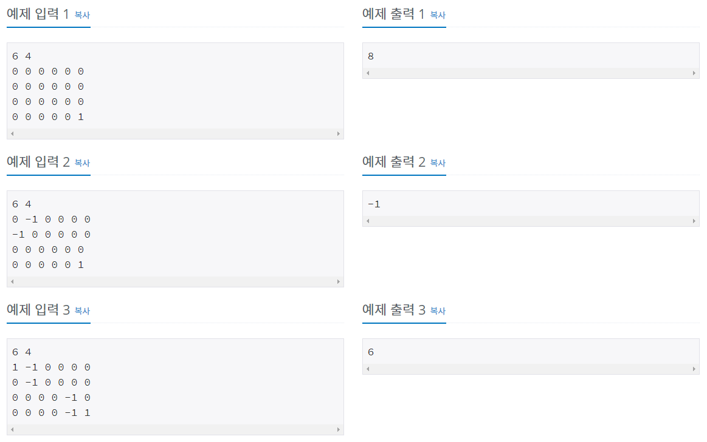
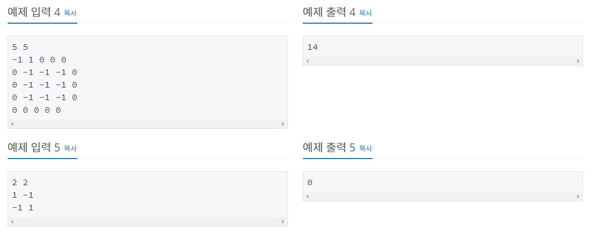
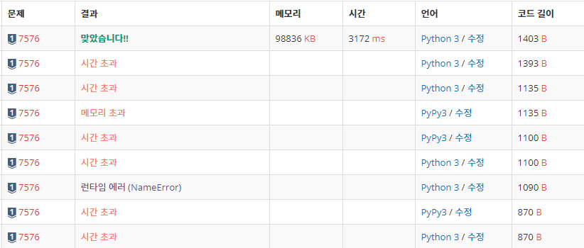
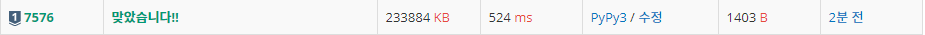

# 토마토 [7576]

백준 - https://www.acmicpc.net/problem/7576

깃헙 - https://github.com/shs9509/study


### 문제

- 철수의 토마토 농장에서는 토마토를 보관하는 큰 창고를 가지고 있다. 토마토는 아래의 그림과 같이 격자 모양 상자의 칸에 하나씩 넣어서 창고에 보관한다. 

  

  


- 창고에 보관되는 토마토들 중에는 잘 익은 것도 있지만, 아직 익지 않은 토마토들도 있을 수 있다. 
- 보관 후 하루가 지나면, 익은 토마토들의 인접한 곳에 있는 익지 않은 토마토들은 익은 토마토의 영향을 받아 익게 된다.
-  하나의 토마토의 인접한 곳은 왼쪽, 오른쪽, 앞, 뒤 네 방향에 있는 토마토를 의미한다. 
- 대각선 방향에 있는 토마토들에게는 영향을 주지 못하며, 토마토가 혼자 저절로 익는 경우는 없다고 가정한다.
- 철수는 창고에 보관된 토마토들이 며칠이 지나면 다 익게 되는지, 그 최소 일수를 알고 싶어 한다.
- 토마토를 창고에 보관하는 격자모양의 상자들의 크기와 익은 토마토들과 익지 않은 토마토들의 정보가 주어졌을 때, 며칠이 지나면 토마토들이 모두 익는지, 그 최소 일수를 구하는 프로그램을 작성하라. 
- 단, 상자의 일부 칸에는 토마토가 들어있지 않을 수도 있다.

------


### 입력

- 첫 줄에는 상자의 크기를 나타내는 두 정수 M,N이 주어진다. 
- M은 상자의 가로 칸의 수, N은 상자의 세로 칸의 수를 나타낸다. 
- 단, 2 ≤ M,N ≤ 1,000 이다. 둘째 줄부터는 하나의 상자에 저장된 토마토들의 정보가 주어진다.
-  즉, 둘째 줄부터 N개의 줄에는 상자에 담긴 토마토의 정보가 주어진다. 
- 하나의 줄에는 상자 가로줄에 들어있는 토마토의 상태가 M개의 정수로 주어진다. 
- 정수 1은 익은 토마토, 정수 0은 익지 않은 토마토, 정수 -1은 토마토가 들어있지 않은 칸을 나타낸다.
- 토마토가 하나 이상 있는 경우만 입력으로 주어진다.

### 출력

- 여러분은 토마토가 모두 익을 때까지의 최소 날짜를 출력해야 한다.
- 만약, 저장될 때부터 모든 토마토가 익어있는 상태이면 0을 출력해야 하고, 토마토가 모두 익지는 못하는 상황이면 -1을 출력해야 한다.





-----


## 풀이과정

- BFS 문제 - 나에게는 상당히 까다로웠던 문제

- 시간초과가 일어나므로 deque 를 사용하였다.

- BFS 알고리즘에서 dr dc를 이용해 사방을 탐색후 거쳐간 토마토를 '1' 로 처리해준다.

  

  - '1'로 처리해주는 타이밍을 사방을 탐색했을 때! 진행한다.
  - 그렇지 않으면 '시간초과' 가 일어난다.

  

- 좌표와 날짜를 한 튜플로 엮어서 진행했다. (x좌표, y좌표, 날짜)


```python
from collections import deque

row, col = list(map(int, input().split())) #가로 세로
section = list()    # 토마토 판
go = 1 
for co in range(col):
    section.append(list(map(int ,input().split())))

for search1 in section: # 모두 익은경우 판별
    if 0 in search1:
        break
else:
    go = 0 

if go: # 모두 안익었다면 시작
    dr = [1,0,0,-1]
    dc = [0,1,-1,0]
    max_day = 0 # 최종날짜를 나타내는값
    S = deque()
    for x in range(col):
        for y in range(row):
            if section[x][y] == 1:   # 토마토가 안익으면 큐에넣는다.
                S.append((x,y,0))   ## 튜플로하면 더좋다 ##
    while len(S) != 0:              # BFS
        start_x, start_y, start_day = S.popleft()
        if max_day <= start_day:    # 날짜가 더 큰경우를 넣는다.
            max_day = start_day
        for i in range(4):
            X = start_x + dr[i]
            Y = start_y + dc[i]
            L = start_day + 1
            if 0 <= X < col and 0 <= Y < row and section[X][Y] == 0:
                section[X][Y] = 1   # 거치는 토마토를 전부 1로 체크
                S.append((X,Y,L))

    for search in section:  # BFS를 거치고 토마토 판에 0 있으면 -1 출력
        if 0 in search:
            print(-1)
            break
    else:   # 0일 없으면 걸렸던 날짜를 출력
        print(max_day)
else:   # 애초에 모두 익었다면 0 출력
    print(go)
```


-------


### 느낀점

- 시간초과가 일어나 답답했던 문제

- 해결방법은 익은 토마토 처리 타이밍이었다.

  

  - 해결코드

  ```python
   for i in range(4):
              X = start_x + dr[i]
              Y = start_y + dc[i]
              L = start_day + 1
              if 0 <= X < col and 0 <= Y < row and section[X][Y] == 0:
                  section[X][Y] = 1   # 거치는 토마토를 전부 1로 체크
                  S.append((X,Y,L))
  ```

  

  - 문제코드

  ```python
   section[X][Y] = 1   # 거치는 토마토를 전부 1로 체크
   for i in range(4):
              X = start_x + dr[i]
              Y = start_y + dc[i]
              L = start_day + 1
              if 0 <= X < col and 0 <= Y < row and section[X][Y] == 0:
                  S.append((X,Y,L))
  ```

  

-  차이점은 '1' 의 처리의 위치이다.

  

  -  해결코드는 탐색된 사방을 '1'로 만들지만
  - 문제코드는 탐색된 부분만을 '1' 로 만들기 때문에 사방탐색에서 중복으로 작업을 한다.
  - 이때문에 시간초과가 일어난다.


- 기존에는 리스트를 사용했는데 메모리적으로 튜플이 더좋다고 하여 튜플을 사용했다.


- 화가난다.




- pypy 를 이용하면 시간이 줄어들었지만 메모리는 오히려 늘어난다.

